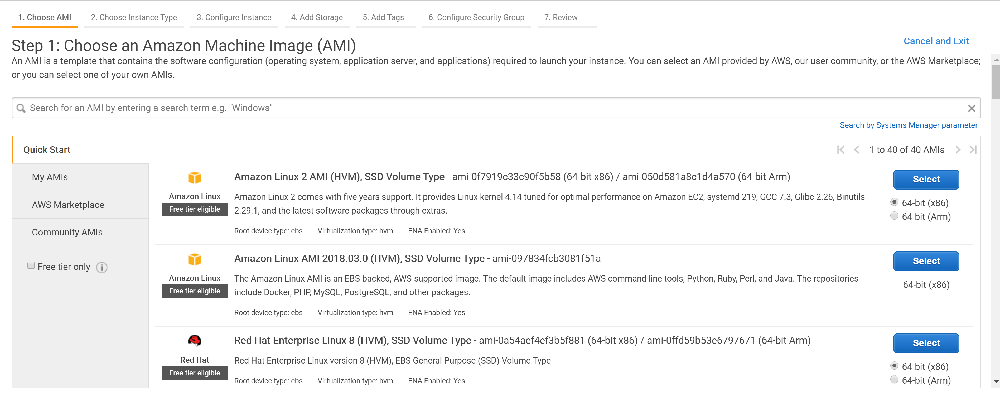
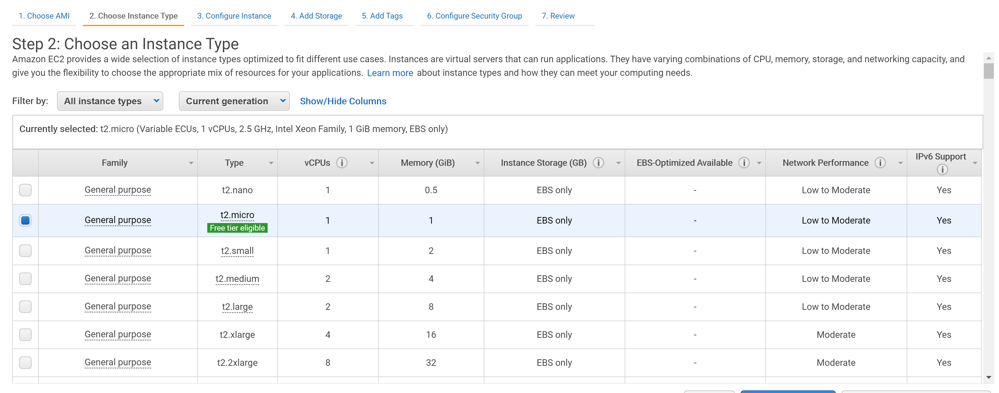
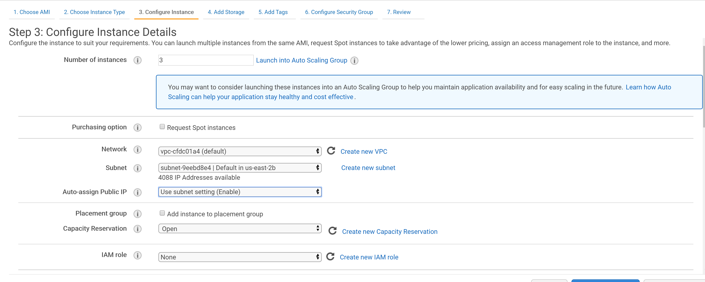
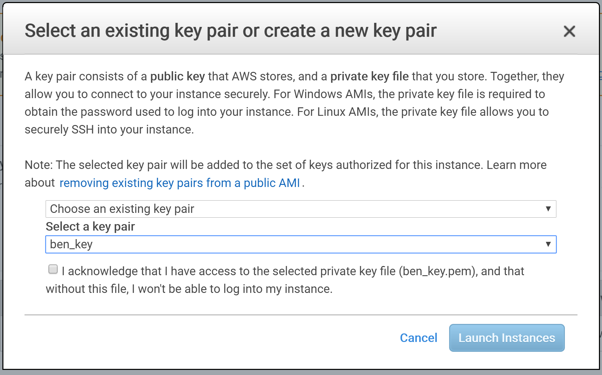
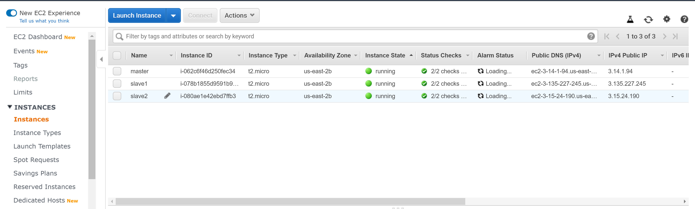
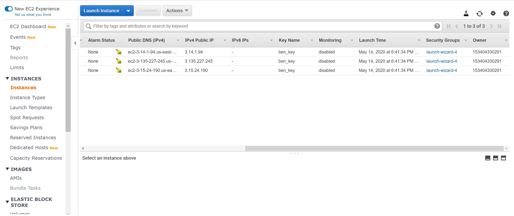
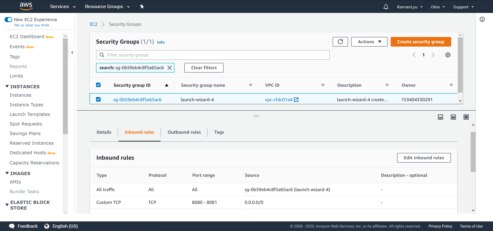
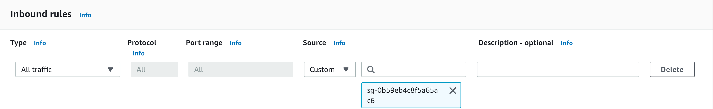

# Report 

## Motivation

Hadoop is the reliable storage and processing of big data over the years. However, MapReduce has the following limitations that make it difficult to use. 

-  A job has only two phases, map and reduce. Complex calculation requires a lot of job and the dependencies between jobs are managed by the developers themselves.
-  Reduce task needs to wait for all map tasks to be completed before starting
-  High time delay and only applies to batch data processing. For interactive data processing and real-time data processing, there is insufficient support.

Apache Spark is an emerging big data processing engine. The main feature is to 

provide a clustered distributed memory abstraction (RDD: Resilient Distributed Dataset) to support applications that require a working set. Using Spark instead of mapreduce is the development trend of big data processing platform. 

## AWS EC2 build Hadoop Cluster

### Overview

We will start three EC2 instances, one for master node, and two for slaves node(workers node).

### Launch EC2 Instance

First apply a free aws account, open the EC2 Dashboard. In the `Instances` tab, click `Launch Instance`.


Then select one Linux machine image, you can choose whatever you are familiar with. Here we choose the first one, an AMI.



Then select a instance type, you can select any one, here we choose the free `t2.micro` instance.



In the instance configure step, leave all the setting to default value, except: `Number of instances`, here we set to 3 (1 master + 2 slaves), you can enter a larger number if you want to have a bigger cluster; and set the `Subnet` to any one to ensure all of the instances belongs to the same subnet.



In next steps, leave all the values as default, or change whatever you need to change. After review the settings, click `Launch`.  In the pop-up window, select a key pair, either by uploading by yourself or by generating a new one. The key pair is used to login in to the instances by ssh. You can learn how to generate and use this key by [https://www.ssh.com/ssh/keygen/](https://www.ssh.com/ssh/keygen/).  



And now you will have three instances, rename them to have a clear organization.




### Configure Network

Edit the hosts files by typing `sudo vim /etc/hosts`, and add the content in the end of the file:

```hosts
172.31.24.111 Master
172.31.17.95 Slave1
172.31.25.29 Slave2
```

Set the three IP address to **private IP** of the three instances. You can get them by typing `ifconfig` and find them in the `eth0` interface. Do the same thing on the slaves machine.

Then go to the EC2 Dashboard, modify the `Security Group`, click the groups,  enter the settings.



In the `Inbound rules` tab, click `Edit inbound rules`. 



In the next page add rule, allow all traffic from the source of the same group.



After all the setting, ping the other machines on each of the three machines. And you should get successful  response.

```bash
ping master -c 4
ping slave1 -c 4
ping slave2 -c 4
```

Next step is generating the ssh key from master, and then send the public key to the slaves, so that master can access slaves without password. After generated the public key, copy the authorized_keys file to two slaves in the same directory (~/.ssh/authorized_keys).

```bash
ssh-keygen -t rsa                                     
cat .ssh/id_rsa.pub >> .ssh/authorized_keys 
```

After that, try to ssh to two slaves from master, if successful, meaning the network is configured correctly.

### Install Hadoop

Scripts use below can be get by [install_hadoop.sh](https://github.com/zhaobenx/Cloud-Computing-Project/blob/master/scirpt/install_hadoop.sh).

First login to the master instance by ssh. Then create `hadoop` user and add it to `su `group. Here we need to remember the password set for the `hadoop `user.

```bash
sudo useradd -m hadoop -s /bin/bash   
sudo passwd hadoop  			        # set the password
sudo usermod -aG wheel hadoop			# add hadoop to sudoer
```

Then type `su hadoop`, enter the password you have set, to switch to the `hadoop` user. Next step is to install java(with JDK) and Hadoop. One import thing is to install java 8, as java 11 is not compatible with Hadoop,  you can run the Hadoop with java 11 but with some unexcepted errors.

```bash
wget http://mirror.cc.columbia.edu/pub/software/apache/hadoop/common/hadoop-3.2.1/hadoop-3.2.1.tar.gz
tar -xzf hadoop-3.2.1.tar.gz
sudo mv hadoop-3.2.1 /usr/local/hadoop
export PATH=$PATH:/usr/local/hadoop/bin:/usr/local/hadoop/sbin
###
sudo yum install java-8-openjdk-devel
echo 'export JAVA_HOME=$(readlink -f /usr/bin/java | sed "s:bin/java::")'>>/usr/local/hadoop/etc/hadoop/hadoop-env.sh
```

Repeat this steps on two slaves machine(add `hadoop` user and install java and Hadoop).

Next step is to change the configure files for Hadoop,  there are five files need to be modified:  `workers`,`core-site.xml`,`hdfs-site.xml`,`mapred-site.xml`,`yarn-site.xml`. Important: in Hadoop 3.0, `slaves` files is renamed to `workers`. You can get the config file from [configure files](https://github.com/zhaobenx/Cloud-Computing-Project/tree/master/config).

Here are some content form the config file:

`workers`

```
Slave1
Slave2
```

`core-site.xml`

```xml
<configuration>
        <property>
                <name>fs.defaultFS</name>
                <value>hdfs://Master:9000</value>
        </property>
        <property>
                <name>hadoop.tmp.dir</name>
                <value>file:/usr/local/hadoop/tmp</value>
                <description>Abase for other temporary directories.</description>
        </property>
</configuration>
```

`hdfs-site.xml`

```xml
<configuration>
        <property>
                <name>dfs.namenode.secondary.http-address</name>
                <value>Master:50090</value>
        </property>
        <property>
                <name>dfs.replication</name>
                <value>2</value>
        </property>
        <property>
                <name>dfs.namenode.name.dir</name>
                <value>file:/usr/local/hadoop/tmp/dfs/name</value>
        </property>
        <property>
                <name>dfs.datanode.data.dir</name>
                <value>file:/usr/local/hadoop/tmp/dfs/data</value>
        </property>
</configuration>
```

`mapred-site.xml`

```xml
<configuration>
        <property>
                <name>mapreduce.framework.name</name>
                <value>yarn</value>
        </property>
        <property>
                <name>mapreduce.jobhistory.address</name>
                <value>Master:10020</value>
        </property>
        <property>
                <name>mapreduce.jobhistory.webapp.address</name>
                <value>Master:19888</value>
        </property>
		<property> 
				<name>mapreduce.application.classpath</name>
				<value>$HADOOP_MAPRED_HOME/share/hadoop/mapreduce/*,$HADOOP_MAPRED_HOME/share/hadoop/mapreduce/lib/*,$HADOOP_MAPRED_HOME/share/hadoop/common/*,$HADOOP_MAPRED_HOME/share/hadoop/common/lib/*,$HADOOP_MAPRED_HOME/share/hadoop/yarn/*,$HADOOP_MAPRED_HOME/share/hadoop/yarn/lib/*,$HADOOP_MAPRED_HOME/share/hadoop/hdfs/*,$HADOOP_MAPRED_HOME/share/hadoop/hdfs/lib/*</value>
		</property>
		<property>
				 <name>yarn.app.mapreduce.am.env</name>
				 <value>HADOOP_MAPRED_HOME=$HADOOP_HOME</value>
		</property>
		<property>
				 <name>mapreduce.map.env</name>
				 <value>HADOOP_MAPRED_HOME=$HADOOP_HOME</value>
		</property>
		<property>
				 <name>mapreduce.reduce.env</name>
				 <value>HADOOP_MAPRED_HOME=$HADOOP_HOME</value>
		</property>
</configuration>
```

`yarn-site.xml`

```xml
<configuration>
        <property>
                <name>yarn.resourcemanager.hostname</name>
                <value>Master</value>
        </property>
        <property>
                <name>yarn.nodemanager.aux-services</name>
                <value>mapreduce_shuffle</value>
        </property>
</configuration>
```

After edited all of these config files, copy the entire directory to the other two slaves:

```bash
scp ./ Slave1:`pwd`
scp ./ Slave2:`pwd`
```

Then run the format command on master node:

```bash
hdfs namenode -format 
```

There will be a successful message `successfully formatted`.

Next to start Hadoop and yarn. On the master machine:

```bash
start-all.sh
```

Then wait for the master and slaves nodes to be started. If successful, use `jps` on each machine, there will be `NameNode`,`ResourceManager`,`SecondrryNameNode`on the master machine; and there will be `DataNode`, `NodeMamager` on the slaves machine.

Run

```bash
hdfs dfsadmin -report
```

to get the report of the cluster, if everything is right, you should get `Live datanodes (2)`in the result.

## AWS EC2 build Hadoop Cluster

### Setup Hadoop

First setup Hadoop as described above.

### Install Spark

Scripts use below can be get by [install_spark.sh](https://github.com/zhaobenx/Cloud-Computing-Project/blob/master/scirpt/install_spark.sh).

As the Hadoop has been installed and configured, we can download the Spark without Hadoop version.

Run the script on master machine:

```bash
wget -nc http://apache.spinellicreations.com/spark/spark-2.4.5/spark-2.4.5-bin-without-hadoop.tgz
sudo tar -zxf spark-2.4.5-bin-without-hadoop.tgz -C /usr/local
sudo mv /usr/local/spark-2.4.5-bin-without-hadoop/ /usr/local/spark
sudo chown -R hadoop /usr/local/spark

echo 'export SPARK_HOME=/usr/local/spark
export PATH=$PATH:$SPARK_HOME/bin:$SPARK_HOME/sbin' >> ~/.bashrc
source ~/.bashrc
```

Then go to the spark configure directory, `cd /usr/local/spark/conf`, to add some configuration.

```bash
echo 'Slave1
Slave2' > slaves
mv spark-env.sh.template spark-env.sh
echo "
export SPARK_DIST_CLASSPATH=\$(/usr/local/hadoop/bin/hadoop classpath)
export HADOOP_CONF_DIR=/usr/local/hadoop/etc/hadoop
export SPARK_MASTER_IP=Master   
export JAVA_HOME=$(readlink -f /usr/bin/java | sed \"s:bin/java::\")" >> spark-env.sh
```

Then repeat the whole process on two slave machines, including the downloading and configuring.

After the Hadoop cluster is correctly started, run 

```bash
start-master.sh  
start-slaves.sh  
```

### Stop the Cluster

```bash
stop-slaves.sh
stop-master.sh
stop-all.sh
```

### Some Issues

1.  You should install java version 8 with JDK, or you cannot use `jps` command.

2. If running with memory issue like `spark failed; error='Cannot allocate memory' (errno=12)`, you should select a instance with larger memory, or you can set swap space for that machine. [Link of how to set swap space](https://linuxize.com/post/how-to-add-swap-space-on-ubuntu-18-04/).

3. If ssh fails with `Host key verification failed `, remove the `~/.ssh/known_hosts` file and try again.

4. If key pair authorized failed, one possible reason is that `~/.ssh/id_rsa` file’s mod is not corrected set, you can use `chmod 500 id_rsa`.

   

